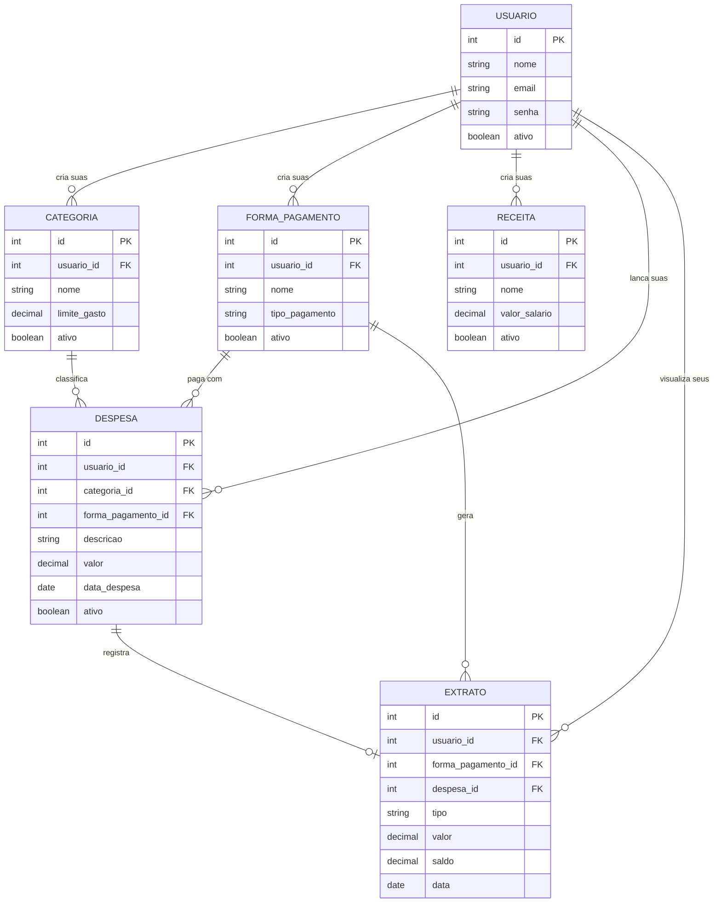
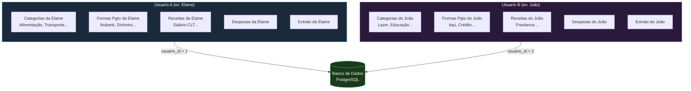
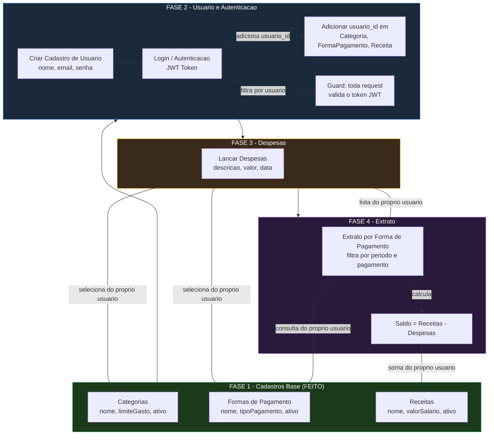
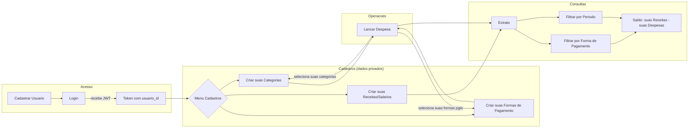
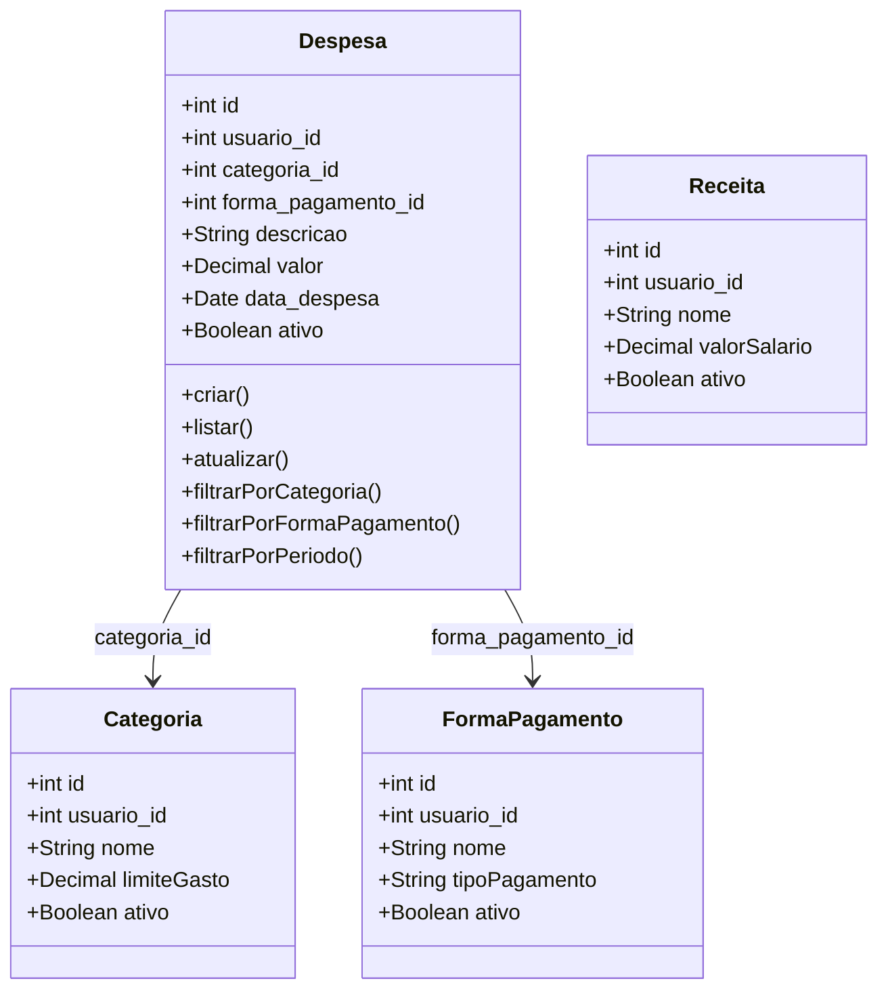
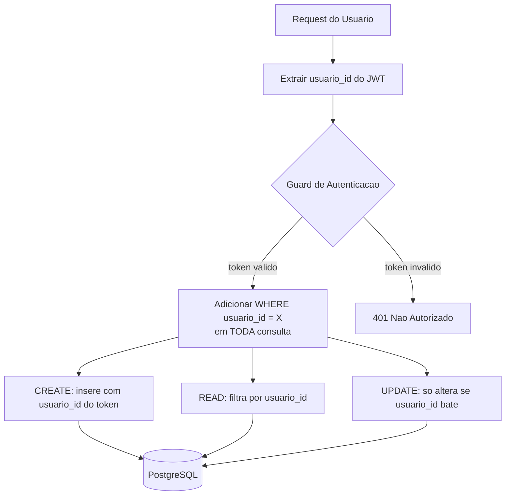
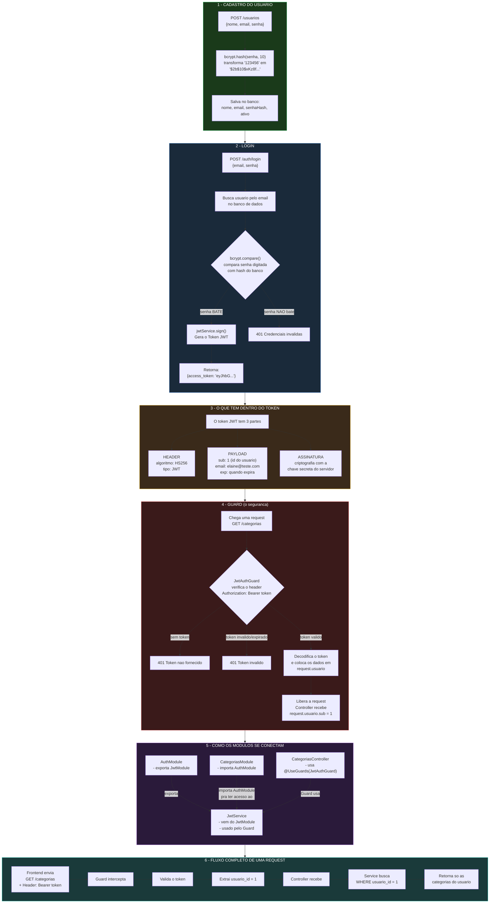

# Fluxo de Relacionamento de Dados - Mi Fortuna

> **Regra fundamental:** Os dados **NÃO** são compartilhados. Cada usuário possui seus próprios dados isolados (categorias, formas de pagamento, receitas, despesas e extratos).

## 1. Diagrama de Entidade-Relacionamento (ER)

## 2. Isolamento de Dados por Usuário

> Todas as consultas (SELECT, UPDATE, DELETE) devem sempre filtrar por `usuario_id` para garantir que um usuário **nunca** acesse dados de outro.

## 3. Fluxo de Implementação (ordem de desenvolvimento)

## 4. Fluxo do Usuario na Aplicacao

## 5. Detalhamento da Entidade DESPESA (a implementar)

> Nota: `usuario_id` em todas as entidades garante que uma Despesa só pode referenciar Categorias e Formas de Pagamento que pertencem ao mesmo usuário.

## 6. Regras de Isolamento por Usuario

## 7. Mapa Mental - Como funciona a Autenticacao JWT

## 8. Resumo das Fases

| Fase | Funcionalidade | Status |
|------|---------------|--------|
| 1 | Categorias, Formas de Pagamento, Receitas | Feito |
| 2 | Cadastro de Usuario + Autenticacao (JWT) + adicionar `usuario_id` nas entidades existentes | A fazer |
| 3 | Lancamento de Despesas (vinculada ao usuario, categoria e forma pgto) | A fazer |
| 4 | Extrato por Forma de Pagamento (dados apenas do usuario logado) | A fazer |

### Ordem recomendada de implementacao:
1. **Usuario + Auth** - Cria a base de seguranca. Adiciona `usuario_id` como FK em Categoria, FormaPagamento e Receita. Toda operacao passa a exigir JWT
2. **Despesa** - Entidade central que conecta Categoria + Forma de Pagamento, sempre filtrada por `usuario_id`
3. **Extrato** - Consulta que agrega Despesas por Forma de Pagamento vs Receitas, sempre do usuario logado
